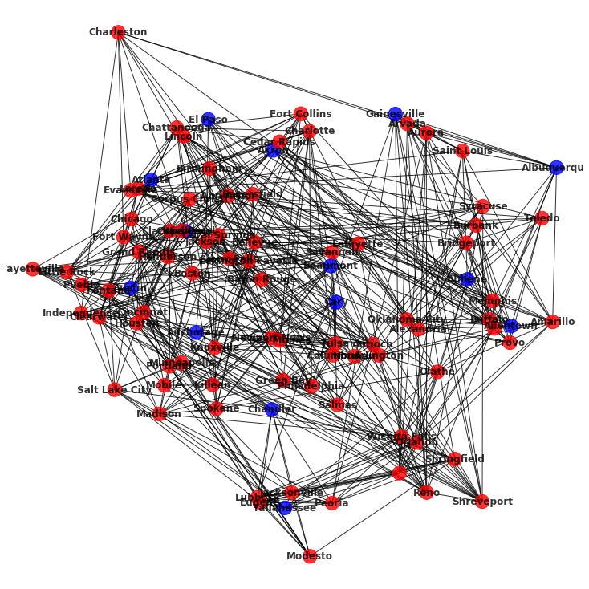
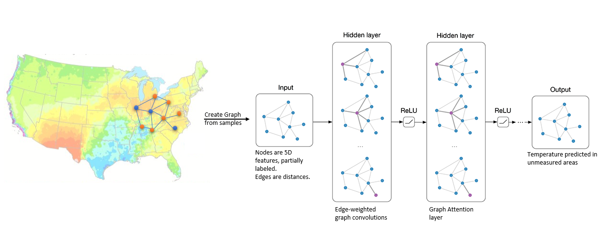

# weather_predict

In this Notebook, we will predict temperature measurements across various locations. Our goal is predicting temperature in areas where it can't be measured currently, using measurements in neighboring areas.

We will do so using a Graph Neural Network based model. Graph Neural Networks (GNN) are commonly being used for tasks such as edge or node labeling, on graphs with partial labeling. Here we have formulated a regression task, attempting to learn temperature values in nodes where these don't exist.

Our data is temperature measurements across the USA, in various days. Each day will be structured as a graph. All graphs will have the same structure (same cities and distances between them). To train the GNN, we will use the complete graphs (graphs which have temperature measurements in all cities). These will be split to X, and Y - X being the 'known' temperatures in specific cities, and Y being the temperatures in cities which we want to predict. During inference, we will input the known temperatures (X) to predict the unknown temperatures (Y).

Below is an example of an input graph - blue nodes are cities for which we have temperature data, and the red nodes are cities for which we want to infer the temperature.

Data structure and algorithm -
- Edges - distance between locations (unlearned)
- Nodes - 7 dimensional features. Altitude and month are pre-initialized and not learned, 3 more dimensions are learned and shared between all dates, and temperature is partially learned (partial supervision - part of the nodes are the input, the rest are learned (initialized with 0). Another feature vector which indicates by one-hot-encoding which temperature measurement is blank.
- Output - one label per node (temp is the ground-truth). Gradients are taken on all nodes.
- Training - a training loop for each day ('dt' column). Learned features (edges and part of the node dimensions) are shared between samples.
- Inference - no learning at all. Using the last learned features of the network. Check on test data, which has unseen dates.

Below is a diagram which describes our flow - Given data with temperature samples in various locations, we want to learn the temperature of neighboring areas. We create a graph from the samples, initialize the nodes and edges as described previously. We then learn the missing temperatures using our model.

